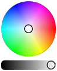
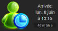

Retrouvez l'ensemble des documentations des réalisations de Salvialf.

# Plugins :

## Pimp my Jeedom

Plugin permettant de personnaliser Jeedom par la gestion simplifiée des widgets tiers et de ceux réalisés par Salvialf.

- [Documentation]({{site.baseurl}}/pimpJeedom/{{page.lang}})
- [Changelog]({{site.baseurl}}/pimpJeedom/{{page.lang}}/changelog)
- <a href="{{site.market}}/index.php?v=d&plugin_id=4005" target="\_blank">Market</a>

## Meeko Family

Plugin permettant d'intégrer l'application de suivi de crèche [**Meeko Family**](https://meeko.pro/family){:target="\_blank"} à Jeedom.

- [Documentation]({{site.baseurl}}/meeko/{{page.lang}})
- [Changelog]({{site.baseurl}}/meeko/{{page.lang}}/changelog)
- <a href="{{site.market}}/index.php?v=d&plugin_id=4023" target="\_blank">Market</a>

# Widgets :

## ClignoBLT (info/numérique)

Widget permettant de faire clignoter une valeur info/numérique et de l'afficher, au choix, sous la forme des widgets *Badge*, *Line* ou *Tile* du core.

- [Documentation]({{site.baseurl}}/ClignoBLT/{{page.lang}})
- [Changelog]({{site.baseurl}}/ClignoBLT/{{page.lang}}/changelog)

## ColorCircle (action/couleur)

Superbe roue chromatique, destinée aux commandes action/couleur, permettant de sélectionner rapidement une couleur précise.

- [Documentation]({{site.baseurl}}/ColorCircle/{{page.lang}})
- [Changelog]({{site.baseurl}}/ColorCircle/{{page.lang}}/changelog)

## ColorSlider (action/couleur)

Roue chromatique proposant diverses options de disposition et d'affichage à base de sliders.

- [Documentation]({{site.baseurl}}/ColorSlider/{{page.lang}})
- [Changelog]({{site.baseurl}}/ColorSlider/{{page.lang}}/changelog)

## ConsigneThermostat (action/curseur)

Widget permettant d'afficher et de modifier une consigne de température. A utiliser avec sur une commande action/curseur.

- [Documentation]({{site.baseurl}}/ConsigneThermostat/{{page.lang}})
- [Changelog]({{site.baseurl}}/ConsigneThermostat/{{page.lang}}/changelog)

## DigitalClock (info/autre)

Widget pour commande virtuelle info/autre permettant l'affichage de la date et de l'heure et dôté de nombreuses options de personnalisation.

- [Documentation]({{site.baseurl}}/DigitalClock/{{page.lang}})
- [Changelog]({{site.baseurl}}/DigitalClock/{{page.lang}}/changelog)

## GaugeIMG (info/numérique)

De superbes jauges animées et colorées pour vos commandes info/numériques.

- [Documentation]({{site.baseurl}}/GaugeIMG/{{page.lang}})
- [Changelog]({{site.baseurl}}/GaugeIMG/{{page.lang}}/changelog)

## IconAction (action/défaut)

Widget qui permet un toggle d'icône sur les commandes action/autre ON & OFF.

- [Documentation]({{site.baseurl}}/IconAction/{{page.lang}})
- [Changelog]({{site.baseurl}}/IconAction/{{page.lang}}/changelog)

## IconInfo (info/binaire)

Visualisez l'état de vos équipements d'un coup d'oeil grâce à ce widget permettant d'afficher une image différente selon l'état (0 ou 1) d'une commande info/binaire.

- [Documentation]({{site.baseurl}}/IconInfo/{{page.lang}})
- [Changelog]({{site.baseurl}}/IconInfo/{{page.lang}}/changelog)

## Linky (info/numérique)

Afficher vos relevés de consommation électrique dans un widget aux couleurs du compteur *Linky*. A appliquer sur 4 commandes info/numérique.

- [Documentation]({{site.baseurl}}/Linky/{{page.lang}})
- [Changelog]({{site.baseurl}}/Linky/{{page.lang}}/changelog)

## PresenceData (info/binaire)

Visualiser en un seul coup d'oeil les informations de présence

- [Documentation]({{site.baseurl}}/PresenceData/{{page.lang}})
- [Changelog]({{site.baseurl}}/PresenceData/{{page.lang}}/changelog)

## ShutterSlider (action/curseur)

Widget visuellement réaliste permettant de contrôler les ouvrants tels que les volets ou les portes de garage. Ce widget est destiné aux commandes action/curseur.

- [Documentation]({{site.baseurl}}/ShutterSlider/{{page.lang}})
- [Changelog]({{site.baseurl}}/ShutterSlider/{{page.lang}}/changelog)

## SliderButton (action/curseur)

Widget pour commandes action/curseur au visuel de boutons + & - inspiré du widget core "Button". Largement personnalisable avec ses nombreux paramètres optionnels.

- [Documentation]({{site.baseurl}}/SliderButton/{{page.lang}})
- [Changelog]({{site.baseurl}}/SliderButton/{{page.lang}}/changelog)
