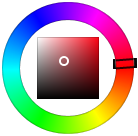

Retrouvez l'ensemble des documentations des réalisations de Salvialf.

# Plugins :

## Pimp my Jeedom

Plugin permettant de personnaliser Jeedom par la gestion simplifiée des widgets tiers et de ceux réalisés par Salvialf.

- [Documentation]({{site.baseurl}}/pimpJeedom/{{page.lang}})
- [Changelog]({{site.baseurl}}/pimpJeedom/{{page.lang}}/changelog)
- <a href="{{site.market}}/index.php?v=d&plugin_id=4005" target="\_blank">Market</a>

# Widgets :

## ClignoBLT (info/numérique)

Widget

- [Documentation]({{site.baseurl}}/ClignoBLT/{{page.lang}})
- [Changelog]({{site.baseurl}}/ClignoBLT/{{page.lang}}/changelog)

## ColorCircle (action/couleur)

Widget

- [Documentation]({{site.baseurl}}/ColorCircle/{{page.lang}})
- [Changelog]({{site.baseurl}}/ColorCircle/{{page.lang}}/changelog)

## ConsigneThermostat (action/curseur)

Widget

- [Documentation]({{site.baseurl}}/ConsigneThermostat/{{page.lang}})
- [Changelog]({{site.baseurl}}/ConsigneThermostat/{{page.lang}}/changelog)

## DigitalClock (info/autre)

Widget

- [Documentation]({{site.baseurl}}/DigitalClock/{{page.lang}})
- [Changelog]({{site.baseurl}}/DigitalClock/{{page.lang}}/changelog)

## GaugeIMG (info/numérique)

Widget

- [Documentation]({{site.baseurl}}/GaugeIMG/{{page.lang}})
- [Changelog]({{site.baseurl}}/GaugeIMG/{{page.lang}}/changelog)

## Linky (info/numérique)

Widget

- [Documentation]({{site.baseurl}}/Linky/{{page.lang}})
- [Changelog]({{site.baseurl}}/Linky/{{page.lang}}/changelog)

## ShutterSlider (action/curseur)

Widget

- [Documentation]({{site.baseurl}}/ShutterSlider/{{page.lang}})
- [Changelog]({{site.baseurl}}/ShutterSlider/{{page.lang}}/changelog)

## SliderButton (action/curseur)

Widget pour commandes action/curseur au visuel de boutons + & - inspiré du widget core "Button". Largement personnalisable avec ses nombreux paramètres optionnels.

- [Documentation]({{site.baseurl}}/SliderButton/{{page.lang}})
- [Changelog]({{site.baseurl}}/SliderButton/{{page.lang}}/changelog)
