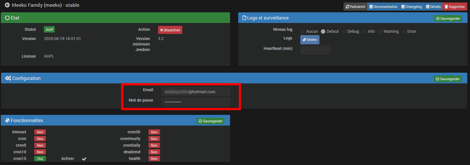
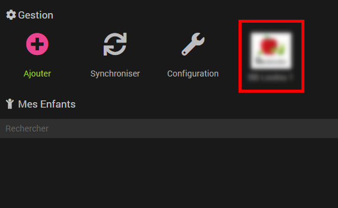
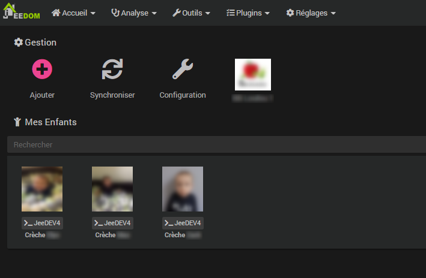
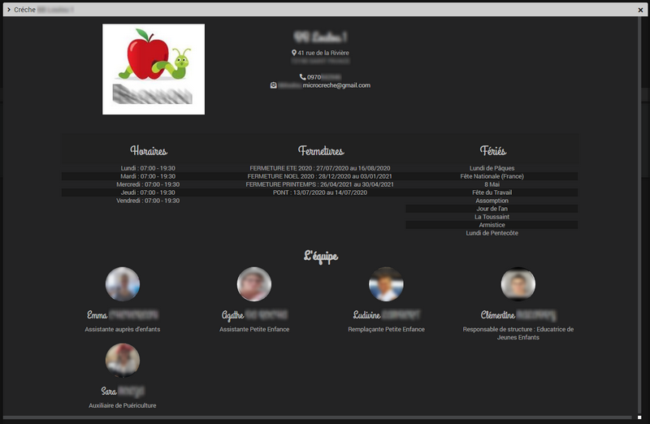
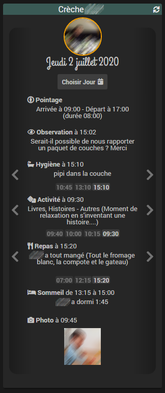
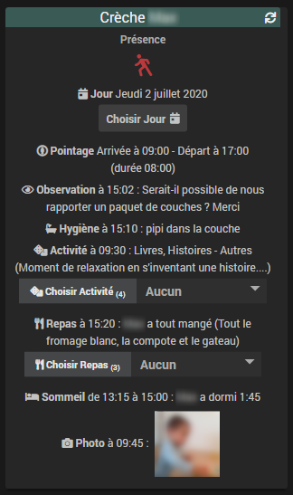
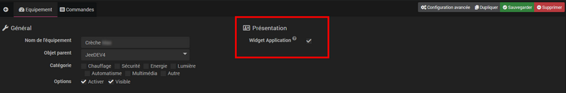

# Description

Plugin permettant d'intégrer l'application de suivi de crèche [**Meeko Family**](https://meeko.pro/family){:target="\_blank"} à Jeedom.

Consultez en un coup d'oeil les activités de vos enfants en temps réel et automatisez les actions lorsqu'ils sont présents à la crèche.

Restez informé des disponibilités et actualités de la structure, de la composition de l'équipe et bien plus encore.

# Installation et synchronisation

Une fois le plugin installé via le market, rendez vous sur la page de configuration pour renseignez l'adresse email ainsi que le mot de passe associés au compte **Meeko Family**. Cliquez sur le bouton *Sauvegarder* et Activez le plugin :    

>**Info**      
>Le plugin utilise un *cron15* actif uniquement entre 7h et 22h pour le rafraichissement des informations.

Les informations de configuration étant renseignées, vous pouvez accéder au plugin via *Plugins->Organisation->Meeko Family*. Au premier accès seules sont accessibles les informations relatives à la structure en cliquant sur le logo de celle-ci :    

Cliquez sur le bouton **Synchroniser** pour créer automatiquement les équipements correspondants à vos enfants :    

# Utilisation

## La structure

En cliquant sur le logo de la crèche vous accédez aux informations relatives à la structure, telles que :
- L'adresse, le numéro de téléphone et l'email de contact,
- Les horaires d'ouverture et les dates de fermeture,
- La composition de l'équipe et leur compétence au sein de la structure.    

## Les activités des enfants

Sélectionnez un *Objet parent* et cliquez sur le bouton **Sauvegarder** pour générer automatiquement les commandes et récupérer les données pour le jour en cours.

# Template ou Widgets

Le plugin utilise par défaut un template dédié permettant de visualiser immédiatement les différentes activités des enfants et de naviguer de l'une à l'autre. Il est possible de désactiver le template pour utiliser des widgets spécifiques :

| Template | Widgets |
|:----------:|:---------:|
|  |  |

Pour désactiver le template, il faut se rendre dans l'équipement et décocher la case **Widget Application** :    

Le bouton **Choisir Jour** permet de sélectionner la journée pour laquelle vous souhaitez consulter les activités des enfants. Au clic sur ce bouton un calendrier s'ouvre, il suffit de sélectionner la date voulue pour que les informations se mettent à jour.

>**A savoir**      
>Sur le template, la photo de l'enfant est entourée d'un rond vert s'il est actuellement présent à la crèche, d'un rond orange s'il a été présent sur la journée et rouge s'il n'a pas été à la crèche ce jour là.

>**Astuce**      
>Les données ne s'affichant que si elles sont disponibles, le contenu peut dans certains cas être plus important que la tuile. C'est pourquoi il est possible de *slider* verticalement dans la tuile en mode template.

# Remerciements

Un grand merci aux équipes [**Meeko**](https://meeko.pro){:target="\_blank"} pour la qualité de leur application ainsi que leur disponibilité.

# Évolutions à venir

Le plugin étant actuellement en version Beta, il reste encore beaucoup de points à finaliser ou à optimiser.

Le bouton **+ Ajouter** permettra à l'avenir de générer de nouveaux équipements au choix, tels que :
- Une tuile cadre photo reprenant toutes les photos prises à la crèche,
- Récupérer les *News* de la crèche,
- Gérer les échanges avec la crèche via une messagerie,
- Accéder aux documents et aux fiches thématiques mises à disposition par la structure.

# Changelog

[Voir le changelog]({{site.baseurl}}/{{page.pluginId}}/{{page.lang}}/changelog)
