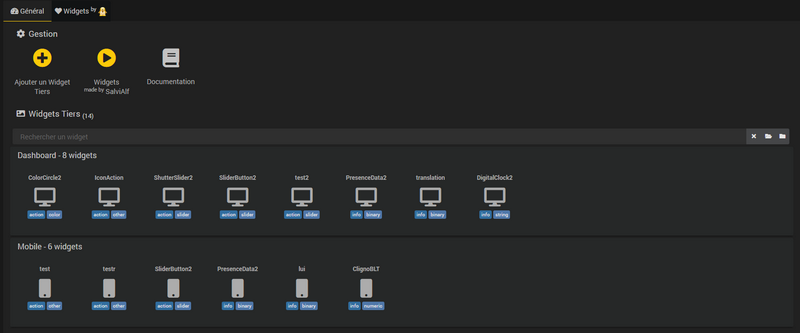
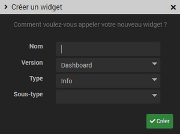
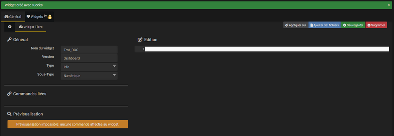
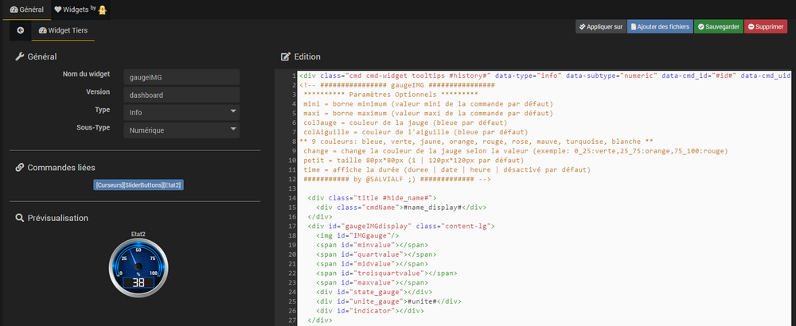

# Description

Plugin pour personnaliser Jeedom.

Permet d'installer, de modifier ou de supprimer les widgets tiers ainsi que les widgets réalisés par Salvialf.

# Installation et accès

Comme tout plugin Jeedom, celui-ci doit être installé et activé.

Ensuite rendez vous dans *Plugins->Programmation->Pimp my Jeedom* pour l'utiliser.

>**Info**      
>Le plugin utilise un *cronDaily* afin de vérifier la présence d'une mise à jour pour les widgets "made by Salvialf". En cas de besoin celui-ci peut être désactivé sur la page de configuration du plugin (*Plugins->Gestion des plugins->Pimp my Jeedom*).

# Utilisation

## Widgets tiers

A l'accès au plugin, vous arrivez sur l'onglet *Général*.

Le plugin liste automatiquement l'ensemble des widgets tiers présents dans le répertoire *data/customTemplates* en les regroupant par version *(dashboard | mobile)* :    

### Ajouter un widget Tiers

Pour ajouter un widget tiers cliquez sur le bouton **"Ajouter un Widgets Tiers"** :    

Une fenêtre s'ouvre afin de renseigner les caractéristiques du nouveau widget *(Nom, Version, Type, Sous-Type)*, Validez en cliquant sur le bouton **Créer** :    

Le nouveau widget est enregistré et vous arrivez directement sur la page de gestion de ce widget :   

### Gérer un widget Tiers

Pour accéder aux détails d'un widget tiers il suffit de cliquer dessus au sein de l'onglet *Général*. Vous arrivez alors sur la page de gestion du widget :    

La page est divisée en plusieurs parties :
* **Général** :
Permet de modifier les propriétés du widget *(Nom, Version, Type, Sous-Type)*.

* **Commandes liées** :
Pour connaitre les commandes sur lesquelles le widget est appliqué.
>**Astuce**   
>Cliquez sur le nom de la commande pour accéder directement à ses paramètres de configuration.

* **Prévisualisation** :
Permet de visualiser le rendu du widget.

* **Édition** :
Pour voir et modifier le code du widget.

* **Boutons du menu**:
  * **Appliquer sur** : Pour choisir les commandes sur lesquelles appliquer ou désappliquer le widget.
  * **Ajouter des fichiers** : Pour ajouter ou supprimer des fichiers au widget.
  * **Sauvegarder** : Pour sauvegarder les modifications faites sur le widget.
  * **Supprimer** : Pour supprimer le widget.

## Widgets made by Salvialf
