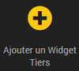
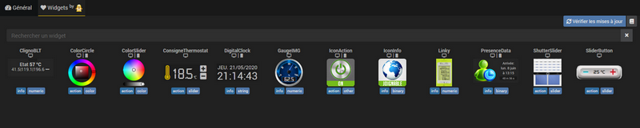
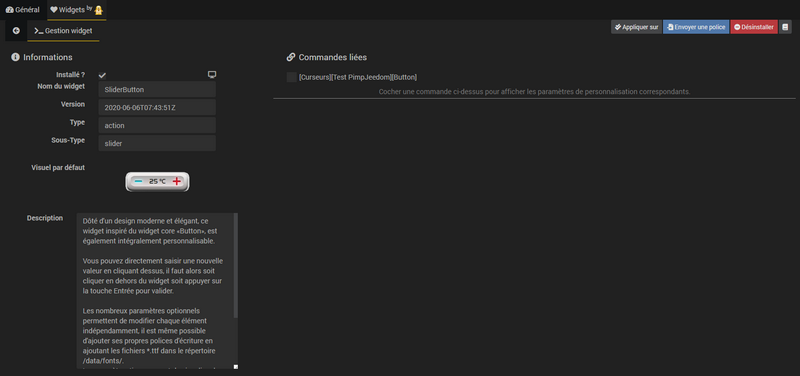
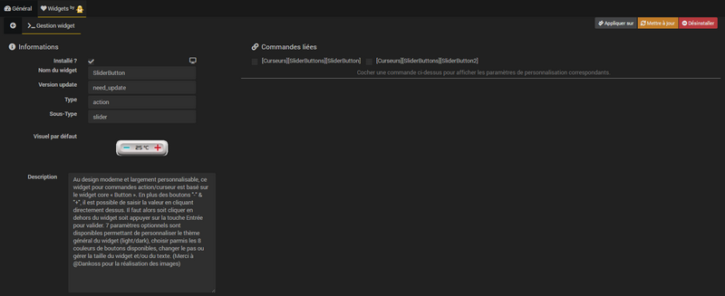

# Description

Plugin pour personnaliser Jeedom.

Permet d'installer, de modifier ou de supprimer les widgets tiers ainsi que les widgets réalisés par Salvialf.

# Installation et accès

Comme tout plugin Jeedom, celui-ci doit être installé et activé.

Ensuite rendez vous dans *Plugins->Programmation->Pimp my Jeedom* pour l'utiliser.

>**Info**      
>Le plugin utilise un *cronDaily* afin de vérifier la présence d'une mise à jour pour les widgets "made by Salvialf". En cas de besoin celui-ci peut être désactivé sur la page de configuration du plugin (*Plugins->Gestion des plugins->Pimp my Jeedom*).

# Utilisation

## Widgets tiers

A l'accès au plugin, vous arrivez sur l'onglet *Général*.

Le plugin liste automatiquement l'ensemble des widgets tiers présents dans le répertoire *data/customTemplates* en les regroupant par version *(dashboard | mobile)* :    

---------------

### Ajouter un widget Tiers

Pour ajouter un widget tiers cliquez sur le bouton **"Ajouter un Widget Tiers"** :    

Une fenêtre s'ouvre afin de renseigner les caractéristiques du nouveau widget *(Nom, Version, Type, Sous-Type)*, Validez en cliquant sur le bouton **Créer** :    

Le nouveau widget est enregistré et vous arrivez directement sur la page de gestion de ce widget :   

-----------------

### Gérer un widget Tiers

Pour accéder aux détails d'un widget tiers il suffit de cliquer dessus au sein de l'onglet *Général*. Vous arrivez alors sur la page de gestion du widget :    

La page est divisée en plusieurs parties :
* **Général** :
Permet de modifier les propriétés du widget *(Nom, Version, Type, Sous-Type)*.

* **Commandes liées** :
Pour connaitre les commandes sur lesquelles le widget est appliqué.
>**Astuce**   
>Cliquez sur le nom de la commande pour accéder directement à ses paramètres de configuration.

* **Prévisualisation** :
Permet de visualiser le rendu du widget en temps réel.

* **Édition** :
Pour voir et modifier le code du widget.

* **Boutons du menu**:
  * **Appliquer sur** : Pour choisir les commandes sur lesquelles appliquer ou désappliquer le widget.
  * **Ajouter des fichiers** : Pour ajouter ou supprimer des fichiers au widget.
  * **Sauvegarder** : Pour sauvegarder les modifications faites sur le widget.
  * **Supprimer** : Pour supprimer le widget.

## Widgets made by Salvialf

Pour accéder aux widgets réalisés par Salvialf cliquez sur le bouton **Widgets made by Salvialf** ou sur l'onglet **Widgets by**  :    

Sur la page d'accueil nous retrouvons en haut à droite un bouton bleu permettant de vérifier les mises à jour de widgets ainsi qu'une icône en forme de livre qui ouvre un lien vers la documentation du plugin spécifique à cette partie.

Au milieu se trouve les tuiles représentant la liste des widgets disponibles dont vous pouvez trouver la liste ainsi que la documentation associée en cliquant [ici](https://salvialf.github.io/Salvialf-Documentation/index/fr_FR/#tocAnchor-1-4){:target="\_blank"}.
>**Info**      
>Les widgets non installés apparaissent en grisés et sont colorés si le widget est installé.

### Installer un widget by Salvialf

Pour installer un widget *"made by Salvialf"* cliquez dessus puis sur le bouton **Installer** :    
   

-----------------

### Gérer un widget by Salvialf

Pour accéder aux détails d'un widget *made by Salvialf* il suffit de cliquer dessus au sein de l'onglet **Widgets by** . Vous arrivez alors sur la page de gestion du widget :    

La page est divisée en plusieurs parties :
* **Informations**:
  * **Installé ?** : la case est cochée si le widget est installé. Des symboles sont présents sur cette ligne pour indiquer la compatibilité du widget avec les versions dashboard et/ou mobile (icône_écran = dashboard, icône_smartphone = mobile).
  * **Nom du widget** : Nom du widget.
  * **Version** : Date de version du widget (*"need_update"* si une mise à jour est disponible).
  * **Type/Sous-Type** : Type et sous-type de commandes sur lesquelles le widget peut être appliqué.
  * **Visuel par défaut** : Image du visuel par défaut.
  * **Description** : Courte description des possiblités offertes par le widget.  

* **Commandes liées** :
Permet de visualiser les commandes sur lesquelles le widget est appliqué. Cocher la case présente juste avant le nom de la commande donne accès aux paramètres optionnels du widget sur cette commande *(voir chapitre "Modifier les paramètres optionnels")*.

* **Boutons du menu**:
  * **Appliquer sur** : Pour choisir les commandes sur lesquelles appliquer ou désappliquer le widget.
  * **Mettre à jour** : Pour mettre à jour le widget. Ce bouton apparait uniquement si une mise à jour est disponible pour le widget concerné.
  * **Envoyer une image** / **Envoyer une police** : Pour ajouter des images ou polices d'écriture directement dans le bon répertoire. Ne s'affiche que si l'option est existante sur le widget.
  * **Désinstaller** : Pour désinstaller le widget.
  * **Icône_Livre** : Pour accéder à la documentation du widget.

### Modifier les paramètres optionnels

Pour les widgets offrant des options de personnalisation, il est possible d'accéder aux paramètres optionnels en cochant la case présente juste avant le nom de la commande à personnaliser :   

La gestion des paramètres optionnels se veut intuitive tant que possible avec simplement 2 boutons :
* **Par défaut** : Pour renseigner les paramètres par défaut du widget. Il sera nécessaire de cliquer sur le bouton "Sauvegarder" pour enregistrer le retour aux paramètres par défaut.
* **Sauvegarder** : Pour enregistrer les nouveaux paramètres optionnels et les voir immédiatement appliqués sur la prévisualisation.

-----------------

### Mettre à jour un widget by Salvialf

Chaque nuit le plugin va vérifier si des mises à jour sont disponibles pour les widgets et afficher un message dans le centre de messages si c'est le cas :   

De plus une pastille de couleur orange avec un point d'exclamation apparait dans la liste sur le widget concerné par une mise à jour disponible :   

En cliquant sur le widget disposant d'une mise à jour on constate que le champ **Version** fait apparaitre la mention *"need_update"* et qu'un bouton de couleur orange nommé **Mettre à jour** est apparu. Il suffit de cliquer sur ce bouton pour procéder à la mise à jour du widget :   
  

# Changelog

[Voir le changelog]({{site.baseurl}}/{{page.pluginId}}/{{page.lang}}/changelog)
